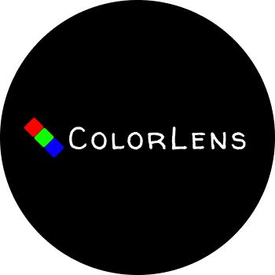

  

### Sobre Mim
Minha trajetória começou no desenvolvimento, com experiência em Java para Android e backend com Java e Spring, o que me proporcionou uma sólida base técnica. No entanto, ao iniciar minha segunda graduação em Ciência de Dados e Machine Learning, encontrei minha verdadeira paixão: dados. A combinação de desenvolvimento, estatística e aprendizado de máquina me fascinou, e desde então, tenho me dedicado a essa área. Ainda assim, de vez em quando, gosto de desenvolver algo novo.

### Meus Projetos

  
  

### Conecte-se Comigo

  

### Sinta-se à vontade para conferir meus repositórios e entrar em contato!